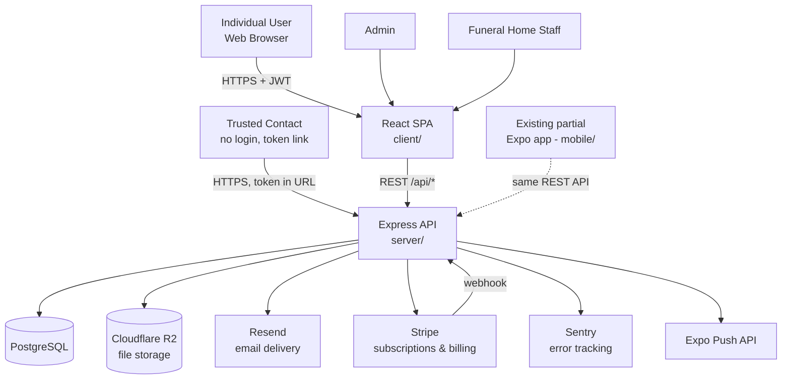
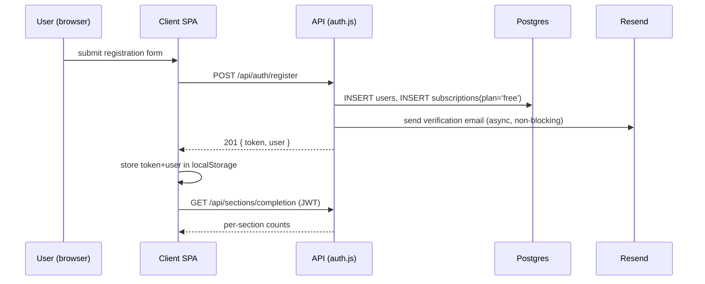
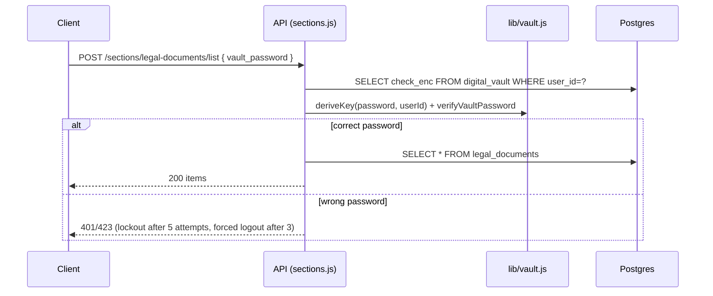

# Current Architecture — In Good Hands

Status: living reference, generated from direct codebase inspection on 2026-08-13.
Scope: the website (`client/` + `server/`) as it exists today, with explicit notes on what a
future mobile client should and should not reuse.

## Executive summary

In Good Hands is an end-of-life planning platform: a React SPA (`client/`) talking to an
Express 5 REST API (`server/`), backed by PostgreSQL. Users record wishes and information
across 14 planning "sections" plus a profile. Three vertical products share one codebase and
one deploy:

1. **Consumer app** — individual Free/Premium users (the only surface Mobile v1 targets).
2. **Admin panel** — internal operations (`client/src/pages/AdminPage.jsx`, `server/routes/admin.js`).
3. **Funeral-home / organization portal** — white-label B2B2C surface (`client/src/pages/org/*`,
   `server/routes/orgPortal.js`, `organizations.js`, `orgPublic.js`, `orgRegister.js`). Deferred
   per current product priorities (see [[project_priority_website_then_marketing]] in project
   memory) but fully implemented in code.

A partial Expo mobile app already exists in `mobile/` (see [MOBILE_INTEGRATION_READINESS.md](./MOBILE_INTEGRATION_READINESS.md))
but is not the subject of this document; this document describes the website/backend that any
mobile client would build against.

## Technology stack

| Layer | Technology | Notes |
|---|---|---|
| Frontend (web) | React 19.2, Vite 8, React Router 7, React-Bootstrap 5 / Bootstrap 5 | SPA, no SSR |
| Backend | Express 5 (Node.js) | Single monolithic API service, `server/index.js` |
| Database | **PostgreSQL** via `pg` (raw SQL, no ORM) | `server/db/database.js` |
| Auth | JWT (`jsonwebtoken`), `bcryptjs` password hashing | Bearer-token, not cookie-based |
| File storage | Cloudflare R2 (S3-compatible, `@aws-sdk/client-s3`) | `server/lib/r2.js` |
| Email | Resend API (raw `fetch`, no SDK) | `server/lib/sendEmail.js` |
| Payments | Stripe (Checkout Sessions + webhooks) | `server/lib/stripe.js`, `routes/stripeWebhook.js` |
| Error tracking | Sentry (`@sentry/node`, `@sentry/react`) | `server/instrument.js`, client `@sentry/react` |
| Scheduled jobs | `node-cron` in-process (no external queue) | `server/index.js` |
| Push notifications | Expo Push API (raw `fetch` to `exp.host`) | `server/lib/inactivityTimer.js` |
| Mobile (partial, existing) | Expo 54 / React Native 0.81 / Expo Router 6 | `mobile/` |
| Hosting | Render (web services + managed Postgres) | `render.yaml` (staging blueprint) |
| CI | GitHub Actions | `.github/workflows/smoke-test.yml` |

**Discrepancy vs. project CLAUDE.md:** CLAUDE.md documents the database as "SQLite via
`better-sqlite3`" with a `DB_PATH` env var. The actual, running implementation is PostgreSQL via
the `pg` driver and `DATABASE_URL` (`server/db/database.js:1-9`). This was already known and
corrected on `origin/main`/`origin/staging` per project memory; the worktree this document was
generated from still carries the stale CLAUDE.md text. Trust this document and the code.

## System context

## Major application components

| Component | Path | Purpose |
|---|---|---|
| Client SPA | `client/src/` | All web UI: routing (`App.jsx`), auth context, section pages |
| API server | `server/index.js` | Express bootstrap: middleware, route mounting, cron jobs |
| Route handlers | `server/routes/*.js` | One file per domain (auth, users, sections, billing, admin, org portal, …) |
| Data access | `server/db/database.js` | Pool + `query`/`queryOne`/`queryAll`/`transaction` helpers, full schema |
| Business libs | `server/lib/*.js` | Vault crypto, subscription logic, PDF generation, inactivity timer, email templates |
| Middleware | `server/middleware/*.js` | `auth.js` (JWT + view-as), `requiresPremium.js`, `orgAuth.js`, `validate.js` |
| Shared package | `shared/` | **Only** `format.js` (phone-number display formatting) — see discrepancy note below |
| Mobile (existing) | `mobile/` | Partial Expo app; see [MOBILE_INTEGRATION_READINESS.md](./MOBILE_INTEGRATION_READINESS.md) |

**Discrepancy vs. CLAUDE.md:** CLAUDE.md describes `shared/` as exporting `api.js`, `auth.js`,
and `constants.js`. In the actual repo, `shared/package.json` only declares one export,
`./format` → `format.js`, which contains a single `formatPhone()` helper. There is no shared API
client, no shared auth helper, and no shared constants module today. Any "shared code" a mobile
client would want (API base paths, validation rules, section IDs) currently lives duplicated
inline in `client/src/` and would need to be extracted, not assumed to already exist.

## Frontend architecture (web)

- **Routing:** `client/src/App.jsx` defines every route in one file via React Router `<Routes>`.
  `ProtectedRoute` wraps authenticated pages and checks `isTokenValid()` (JWT expiry only — no
  server round-trip) plus optional `adminOnly` / `allowRoles` (org role) gates.
- **State/context:**
  - `context/AuthContext.jsx` — token + user in `localStorage`, axios interceptors for
    attaching the bearer token and handling 401/expiry, plus a "view-as" session-swap mechanism
    for org staff.
  - `context/SubscriptionContext.jsx` — fetches `GET /api/billing/access` on mount, exposes
    `isPremium`/`plan`, **fails open to `premium`** on error or before the first fetch resolves
    (client-side convenience only; the server is the real enforcement point via `requirePremium`).
  - `context/BrandingContext.jsx` — site name/logo, driven by `GET /api/settings` (admin
    white-labelling) and, when a customer is linked to an org, `GET /api/users/me/org-branding`.
- **Section pages:** `client/src/pages/sections/*.jsx` — one page per section, following a
  consistent fetch-on-mount → `ItemCard` list → `FormModal` create/edit pattern (per CLAUDE.md,
  confirmed present).
- **Theming:** `App.jsx` defines 9 CSS-variable theme palettes and 6 font stacks, applied by
  writing custom properties onto `<html>`; selection stored server-side in `app_settings` and
  fetched on boot.

## Backend architecture

- **Entry point:** `server/index.js` — Sentry init, `helmet`, a **custom hand-rolled CORS
  middleware** (not the `cors` npm package) that reflects `Origin` only when it exactly matches
  `process.env.CLIENT_URL`, two `express-rate-limit` tiers (200 req/15min general API, 20
  req/15min on `/api/auth/*`, `/api/org-links/*`, `/api/org-register/*`), a maintenance-mode gate
  reading `app_settings.maintenance_mode`, then route mounting.
- **Stripe webhook** is mounted with `express.raw()` **before** the global `express.json()`
  parser, since Stripe's signature verification needs the raw body (`index.js:38`).
- **No ORM.** All data access is parameterized raw SQL through `server/db/database.js`'s
  `query`/`queryOne`/`queryAll`/`transaction` helpers, called directly from route handlers.
- **No separate migration runner.** Schema evolves via idempotent `CREATE TABLE IF NOT EXISTS`
  and `ALTER TABLE ... ADD COLUMN IF NOT EXISTS` statements run inline at startup
  (`database.js`'s `init()`), plus a couple of one-time, settings-gated data migrations (e.g. the
  premium "grandfather" cutover).
- **Error handling:** a final Express error handler (`index.js:109-122`) logs full detail
  server-side but returns a generic `{ error: 'Something went wrong...' }` to the client in
  production (`NODE_ENV === 'production'` on both staging and prod Render services), per SEC-08.
- **Audit logging:** `user_audit_logs` table, written via a small `auditLog()` helper duplicated
  in a few route files (`auth.js`, `users.js`, `admin.js`, `sections.js` view-as path). Captures
  action, IP, user-agent, JSON metadata.

## Database / data-access architecture

PostgreSQL, no ORM, connection pooled via `pg.Pool`. See [DATABASE_MODEL.md](./DATABASE_MODEL.md)
for the full entity breakdown. Key architectural points:

- Every user-owned table FKs to `users(id)`, almost always `ON DELETE CASCADE`, so account
  deletion (`DELETE /api/users/me`) cleanly cascades without app-level cleanup code for most
  tables (uploaded files in R2 are the exception — deleted explicitly in the route handler since
  R2 isn't part of the Postgres transaction).
- `subscriptions` is a separate 1:1 table from `users`, not a column on `users` — see
  [USER_ACCESS_MODEL.md](./USER_ACCESS_MODEL.md) for why this matters.
- SSL to the database is enabled automatically whenever `DATABASE_URL` doesn't point at
  `localhost`/`127.0.0.1` (`database.js:5-7`), with `rejectUnauthorized: false` — standard for
  Render's managed Postgres.

## Authentication architecture

Covered in full in [AUTH_ARCHITECTURE.md](./AUTH_ARCHITECTURE.md). Headline: auth is **stateless
bearer-token JWT**, not cookie/session-based, and CORS (a browser-only concept) doesn't gate a
native mobile client the way it gates the web SPA — this is a meaningfully mobile-friendly
starting point.

## External integrations

| Service | Purpose | Reached directly by mobile, or only via API? |
|---|---|---|
| Stripe | Subscriptions, checkout, billing | Only via API — never call Stripe directly from a client |
| Cloudflare R2 | Document/photo storage | Only via API — client gets short-lived signed URLs |
| Resend | Transactional email | Server-only |
| Sentry | Error tracking | Both — client SDK (`@sentry/react`) and server SDK independently |
| Expo Push API | Push notifications | Server-only (server calls `exp.host`); a mobile client only needs to register its own push token via `POST /api/users/me/device-token` |
| Deezer (proxied) | Song search for "Songs That Define Me" | Only via API — `server/routes/deezer.js` proxies so no Deezer credentials reach the client |

Full detail: [EXTERNAL_SERVICES_AND_INFRASTRUCTURE.md](./EXTERNAL_SERVICES_AND_INFRASTRUCTURE.md).

## Hosting / deployment architecture

- **Render**, both for the web services and managed Postgres. `render.yaml` in the repo root is
  explicitly a **staging-only** Blueprint (`in-good-hands-api-staging`, `in-good-hands-client-staging`,
  `in-good-hands-db-staging`); production services (`performance-api`, `performance-client`,
  `in-good-hands-db` per the file's own header comment, custom domain `ingoodhandsplan.com` per
  project memory) are provisioned separately and are not captured in a checked-in Blueprint file.
- Client deploys as a **static site** (Vite build output), with an explicit SPA rewrite rule
  (`/* → /index.html`) so client-side routes and Stripe's `success_url` redirect don't 404 at
  Render's static file server.
- Server deploys as a Node web service, `npm install` + `node index.js`.
- Free-tier Render services (staging) spin down after 15 minutes idle and the free Postgres
  auto-deletes after 90 days of inactivity — a staging-only operational caveat, not a production
  concern.

## Environment structure

Three logical environments: local dev, staging, production. Staging and production are separate
Render service groups with separate databases, separate `JWT_SECRET`s, and (recommended, per
`render.yaml` comments) separate R2 buckets. Stripe uses **test-mode** keys for both local dev
and staging (fully sandboxed, no real money), and presumably live-mode keys only in production
(not verifiable from checked-in config — mark as **assumption**, verify before relying on it).

## Major data flows

**Registration → first section entry:**

**Vault-protected read (e.g. Legal Documents list):**

## Important dependencies

- `pg` — sole database driver, no ORM abstraction to swap out.
- `jsonwebtoken` + `bcryptjs` — entire auth stack; no third-party auth provider (Auth0, Clerk,
  Firebase Auth, Supabase Auth) is in use.
- `stripe` — official SDK, used for both consumer (`billing.js`) and org (`organizations.js`,
  `orgPortal.js`) billing.
- `@aws-sdk/client-s3` — talks to R2 via its S3-compatible endpoint, not an R2-specific SDK.
- `node-cron` — in-process scheduler; jobs die with the process and don't survive a restart
  mid-run (no persistent job queue like BullMQ/pg-boss).

## Known architectural constraints

- **No ORM / no typed schema.** Every query is hand-written SQL with positional `$1, $2, ...`
  parameters. Adding a mobile client means hand-writing more of the same, or introducing a schema
  layer — there is no Prisma/TypeORM schema to generate a mobile-friendly client from.
- **No API versioning.** Routes are unprefixed (`/api/sections/...`, not `/api/v1/...`). A mobile
  client and the web client will always be coupled to the same API surface; there is currently no
  mechanism to evolve the API for mobile without also affecting web, or vice versa.
- **No refresh tokens.** A single 8-hour JWT with no rotation/refresh. A mobile app expecting
  long-lived "stay signed in" behavior (days/weeks) will hit this limit and needs either a longer
  mobile-specific expiry, a refresh-token flow, or accept 8-hour re-logins — an explicit decision
  to make (see [AUTH_ARCHITECTURE.md](./AUTH_ARCHITECTURE.md)).
- **Single monolithic Express service.** All domains (consumer, admin, org portal, billing)
  share one deployable. There's no per-domain scaling or isolation.
- **In-process cron**, single instance assumed — if Render ever scales the API to multiple
  instances, the daily inactivity/backup jobs would need a leader-election or external-scheduler
  fix to avoid running N times. Not a current problem (services are single-instance today) but a
  known trigger for future change.

## Known technical debt (clearly evident in code)

- **Duplicate "favourites" data model.** `users.js` exposes `/me/songs` and `/me/bucket-list`
  against `favourite_songs` / `bucket_list_items` tables, gated by per-user boolean flags
  (`songs_enabled`, `bucket_list_enabled`) bundled into the profile payload — while `sections.js`
  separately exposes `songs-that-define-me` and `lifes-wishes` as full 14-section entities with
  their own tables, gated by nothing (free for everyone). Both pairs are live in the client. This
  looks like an earlier, parallel implementation that was never fully retired. See
  [BUSINESS_LOGIC_MAP.md](./BUSINESS_LOGIC_MAP.md) for detail — **do not build mobile against
  both without understanding which one the web UI actually surfaces as "the" feature.**
- **`shared/` package is nearly empty** relative to what CLAUDE.md describes (see above) — no
  actual code-sharing infrastructure exists yet between client/mobile beyond one formatting
  helper.
- **`VAULT_KEY` env var is dead config.** CLAUDE.md and the server env var list both reference
  it, but vault encryption keys are derived per-request from the user's own vault password
  (`scryptSync(password, userId-derived-salt)`), never from a server-side secret
  (`server/lib/vault.js`). `render.yaml` explicitly calls this out as unused. Do not provision it
  for a new deployment.

## Areas that should NOT be duplicated in the mobile app

- Admin panel and all `server/routes/admin.js` functionality.
- Organization/funeral-home portal (`orgPortal.js`, `organizations.js`, `orgPublic.js`,
  `orgRegister.js`) and its client pages (`client/src/pages/org/*`, `admin/OrganizationsPanel.jsx`).
- PDF export generation logic (`server/lib/generatePdf.js`) — server-side only; a mobile client
  should link out to the website for this, not reimplement PDF rendering.
- Vault cryptography (`server/lib/vault.js`) — must stay server-side; there is no case for
  reimplementing AES-256-GCM/scrypt key derivation on-device.
- The inactivity-timer/executor/"report a passing" workflow's business logic
  (`server/lib/inactivityTimer.js`, `server/lib/deceased.js`) — this is account-lifecycle logic
  that must have exactly one implementation.
- The hand-rolled CORS middleware — irrelevant to a native client and not something to port.

## Areas that should ideally be reused/shared by the mobile app

- The entire REST API surface for free-tier sections (see
  [API_AND_SERVICE_MAP.md](./API_AND_SERVICE_MAP.md) and
  [FREE_PLAN_FEATURES.md](./FREE_PLAN_FEATURES.md)).
- JWT bearer-token auth (`POST /api/auth/login`, `/register`, etc.) — already proven to work
  from a non-browser client (see `mobile/src/lib/api.js`, which already does this).
- `getUserPlan()`/`isPremium()` (`server/lib/subscription.js`) and the `requirePremium`
  middleware as the single source of truth for entitlement — mobile must call
  `GET /api/billing/access`, never infer premium status independently.
- Expo push token registration (`POST /api/users/me/device-token`) and the server-side push
  send path — already wired for Expo specifically, not a generic push abstraction.
- Business/completion logic in `GET /api/sections/completion` rather than recomputing "is this
  section done" client-side.
