# Database Model — In Good Hands

- **Technology:** PostgreSQL, accessed via the `pg` driver's connection pool.
- **ORM:** none. All access is raw parameterized SQL through `server/db/database.js`'s
  `query`/`queryOne`/`queryAll`/`transaction` helpers.
- **Schema source of truth:** `server/db/database.js`, `init()` function — every table is
  `CREATE TABLE IF NOT EXISTS`, every schema change since is `ALTER TABLE ... ADD COLUMN IF NOT
  EXISTS`, run inline at server startup. There is no separate migration file history.

## Entity groups

### 1. Identity & account

**`users`** — the root entity. Purpose: one row per human account (individual consumers, admin,
org staff — no separate tables per role). Key columns beyond the obvious: `is_admin`,
`org_role`/`organization_id`/`organization_location_id`/`is_active` (org staff only),
`is_deceased`/`deceased_at`/`deceased_by`, `session_version` (auth invalidation),
`vault_locked_until` (vault lockout), `inactivity_period_months` +
`inactivity_test_override_minutes` (QA-only), `expo_push_token`, plus "How I'd Like to Be
Remembered" fields (`about_me`, `legacy_message`, `life_story`, `remembered_for`) stored directly
on the user row rather than a child table, and marital/spouse fields (`marital_status`,
`spouse_name`, `spouse_phone`, `spouse_email`).

- Depended on by: nearly every other table (FK `user_id`).
- Mobile MVP needs: yes, centrally — profile read/write, the "How I'd Like to Be Remembered"
  fields, emergency contact fields.

### 2. Plan / billing

**`subscriptions`** (1:1 with `users`) — plan (`free`/`premium`), status, Stripe references
(`provider_customer_id`, `provider_subscription_id`, `provider_price_id`), `granted_by_admin_id`
(admin honorary grants), `organization_id` (org-sponsored grants). See
[USER_ACCESS_MODEL.md](./USER_ACCESS_MODEL.md) for full semantics.

**`payment_methods`** — cached Stripe payment-method metadata (brand/last4/expiry) for display;
the delete route is a stub (`501 Not yet available`).

Mobile MVP needs: **read-only**, via `GET /api/billing/access` and `GET /api/billing/plans` — no
direct table access, and no checkout flow (checkout is explicitly a web/website-redirect concern).

### 3. Planning sections (the 14-section core product)

One table per section, all `user_id`-scoped, all `ON DELETE CASCADE` from `users`:

| Table | Section | Vault-protected? | Free or Premium (server-enforced) |
|---|---|---|---|
| `legal_documents` | Legal Documents | Yes | Premium |
| `financial_items` | Financial Affairs | Yes | Premium |
| `property_items` | Property & Possessions | Yes | Premium |
| `household_info` | Practical Household Info | Yes | Premium |
| `digital_credentials` (+ `digital_vault`) | Digital Life (vault) | Yes (it *is* the vault) | Premium |
| `funeral_wishes` | Funeral & End-of-Life Wishes | No | Free |
| `medical_wishes` | Medical & Care Wishes | No | Free |
| `people_to_notify` | People to Notify | No | Free |
| `personal_messages` | Messages to Loved Ones | No | Free |
| `songs_that_define_me` | Songs That Define Me | No | Free |
| `life_wishes` | Life's Wishes / Bucket List (section) | No | Free |
| `children_dependants` | Children & Dependants | No | Free |
| *(fields on `users`, no table)* | How I'd Like to Be Remembered | No | Free |
| `trusted_contacts` + `trusted_contact_permissions` | Key Contacts / sharing | No | Free |

`digital_vault` holds **only** a verification blob (`check_enc`) — proof a correct password
decrypts a known constant — never the vault password itself. `digital_credentials` holds the
actual encrypted secrets (`username_enc`/`password_enc`/`notes_enc`, each a JSON blob of
`{ciphertext, iv, tag}` from AES-256-GCM). See [AUTH_ARCHITECTURE.md](./AUTH_ARCHITECTURE.md) —
this crypto must stay server-side.

Mobile MVP needs: every **Free** row in the table above; explicitly not the **Premium** rows for
v1 (see [FREE_PLAN_FEATURES.md](./FREE_PLAN_FEATURES.md)).

### 4. Legacy/parallel "favourites" tables (technical debt — read before building)

**`favourite_songs`** and **`bucket_list_items`** — per-user lists, gated by `users.songs_enabled`
/ `users.bucket_list_enabled` booleans (not by plan), surfaced via `GET/POST/DELETE
/api/users/me/songs` and `/me/bucket-list`, and folded into the `GET /api/users/me` payload. These
are **separate tables from, and functionally overlapping with**, `songs_that_define_me` and
`life_wishes` above. See [BUSINESS_LOGIC_MAP.md](./BUSINESS_LOGIC_MAP.md) for the recommendation:
confirm with the product owner which pair is "live" in the current web UI before building a mobile
equivalent of either.

### 5. Documents / files

**`uploaded_documents`** — one row per file in R2. Columns: `section_id` (text, which section it
belongs to), `item_id` (nullable, loosely links to a specific row in that section's table — not
FK-enforced), `r2_key` (unique), `size_bytes`, `mime_type`, `photo_role` (nullable — `funeral_main`
/ `funeral_gallery`, used for Funeral Wishes photo uploads specifically). Sensitivity (whether the
vault password is required to access a given document) is derived server-side from `section_id` at
request time via `VAULT_PROTECTED_SECTIONS`, never trusted from the client.

Mobile MVP needs: yes, for Free-tier sections that support photos (Funeral Wishes gallery) — but
premium-section document uploads (e.g. Legal Documents attachments) are out of v1 scope.

### 6. Sharing / trusted contacts

**`trusted_contacts`** (max 3 per user, `sequence` 1–3, at most one flagged `is_executor` via a
partial unique index) + **`trusted_contact_permissions`** (which sections a given contact can see)
+ **`trusted_contact_tokens`** (single active 72-hour access-link token per contact, regenerated
on demand). This powers the public, no-login `GET /api/access/:token` view
(`server/routes/access.js`) that a trusted contact (not a platform user) opens from an emailed
link. Executors additionally get a `mark-demised` capability from that same token.

Mobile MVP needs: the owner-side management (add/edit/remove contacts, set permissions, send
access link) is a genuinely Free feature and a reasonable mobile candidate. The **recipient-side**
public access page is a web-only concern (it's opened from an email link, not an authenticated app
session) and not part of Mobile v1.

### 7. Audit / operational

**`user_audit_logs`** — action, IP, user-agent, JSON metadata, `ON DELETE SET NULL` (so deleting a
user doesn't destroy the historical log entry, only anonymizes it). Written from multiple route
files via small locally-duplicated `auditLog()` helpers, not a shared module.

**`app_settings`** — key/value store for site-wide config (theme, font, logo, maintenance mode,
password-reset method). `GET /api/settings` is public/unauthenticated — mobile can and should call
it for branding/theme parity.

**`app_versions`** — semver change log across three tracked "modules" (`client`, `admin`,
`org_portal`) — **note: `mobile` is not a tracked module today**; a future mobile release-tracking
convention would need its own row type or a schema change (`app_versions.module` has a `CHECK`
constraint limiting it to the current three values).

### 8. Organization / funeral-home portal (out of scope for Mobile v1)

`organizations`, `organization_locations`, `organization_contacts`, `organization_customers`,
`organization_customer_tokens`, `organization_admin_invites`, `organization_billing_events`. Fully
implemented (see [USER_ACCESS_MODEL.md](./USER_ACCESS_MODEL.md)); irrelevant to an individual free
mobile user except that a consumer account *could* be linked to an org as a customer
(`organization_customers.user_id`) — mobile should tolerate that field existing on
`GET /api/users/me/org-consent` without needing to build any org UI around it.

## Entity relationship diagram (core, mobile-relevant subset)

```mermaid
erDiagram
    users ||--o| subscriptions : "has plan"
    users ||--o{ trusted_contacts : "names up to 3"
    trusted_contacts ||--o{ trusted_contact_permissions : "grants section access"
    trusted_contacts ||--o{ trusted_contact_tokens : "access links"
    users ||--o{ funeral_wishes : "free section (1:1)"
    users ||--o{ medical_wishes : "free section (1:1)"
    users ||--o{ people_to_notify : "free section (many)"
    users ||--o{ personal_messages : "free section (many)"
    users ||--o{ songs_that_define_me : "free section (many)"
    users ||--o{ life_wishes : "free section (many)"
    users ||--o{ children_dependants : "free section (many)"
    users ||--o{ favourite_songs : "legacy parallel table"
    users ||--o{ bucket_list_items : "legacy parallel table"
    users ||--o| digital_vault : "premium (1:1)"
    digital_vault ||--o{ digital_credentials : "encrypted secrets"
    users ||--o{ legal_documents : "premium"
    users ||--o{ financial_items : "premium"
    users ||--o{ property_items : "premium"
    users ||--o{ household_info : "premium"
    users ||--o{ uploaded_documents : "files, any section"
    users ||--o{ user_audit_logs : "security/audit trail"
```

## Important enums / status fields

| Field | Values | Meaning |
|---|---|---|
| `subscriptions.plan` | `free`, `premium` | Entitlement |
| `subscriptions.status` | `active`, `trialing`, others (Stripe-driven, e.g. `past_due`, `canceled`) | Only `active`/`trialing` count as usable premium |
| `subscriptions.provider` | `stripe`, `admin_grant`, `org_grant`, `grandfathered`, `null` (free) | How premium was obtained; cosmetic for access control |
| `users.org_role` | `org_admin`, `org_staff`, `null` | Org portal identity |
| `organization_customers.lifecycle_status` | `invited`, `signed_up`, `plan_in_progress`, `plan_completed`, `deceased`, `archived` | Org-portal customer journey stage |
| `life_wishes.status` | free text, defaults `'dream'` | Not a hard enum — no `CHECK` constraint |
| `app_versions.module` | `client`, `admin`, `org_portal` (CHECK-constrained) | Does not include `mobile` |

## Migration / evolution rule (per project CLAUDE.md, confirmed followed in code)

New columns are always added with `ADD COLUMN IF NOT EXISTS`; existing columns are never dropped
or renamed (an explicit example of course-correcting a mistake **without** a rename:
`organization_billing_events.changed_by_user_id`'s FK was widened from no delete-action to `ON
DELETE SET NULL` via a documented `DROP CONSTRAINT` + `ADD CONSTRAINT`, not a column rename). A
mobile-driven schema need (e.g. a `user_devices` table for multi-device push) would follow the
same additive pattern.
