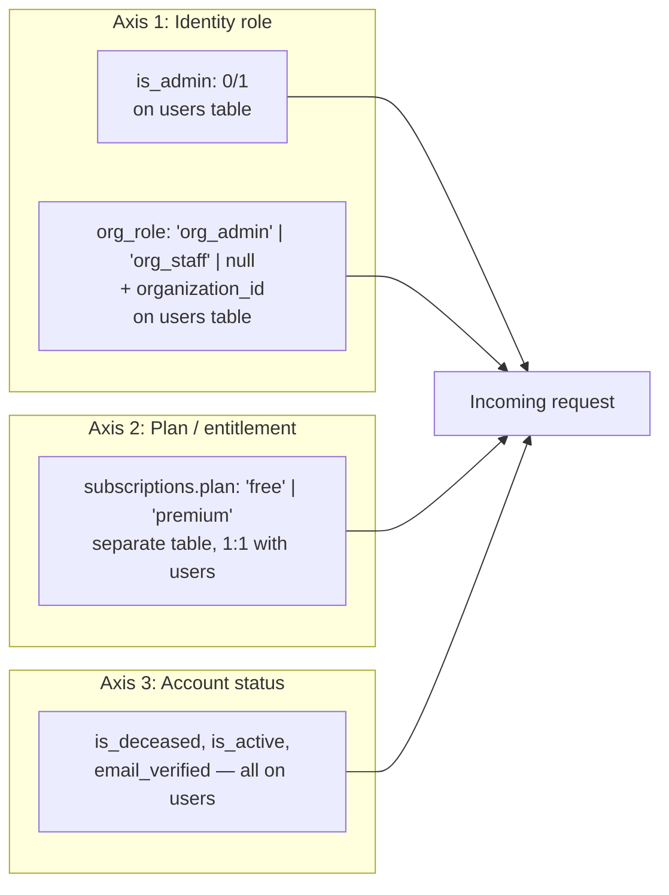

# User Access Model — In Good Hands

## The three overlapping axes

The system does **not** have one unified "role" concept. It has three independent axes that
combine to determine what a request can do. This is a real characteristic of the implementation,
not a simplification for this document — code references below show each axis is checked
separately, in different files, by different middleware.



### Axis 1 — Identity role: `is_admin` + `org_role`

- `users.is_admin` — integer `0`/`1`. Set only via direct DB seed (the one bootstrap admin,
  `admin@igh.local`) or, presumably, manual DB action — there is no API route that grants
  `is_admin` to another user. Checked by an inline `adminOnly` middleware **duplicated** in
  `admin.js`, `organizations.js`, `settings.js` (each file defines its own copy rather than
  importing a shared one).
- `users.org_role` — text, `'org_admin' | 'org_staff' | null`, paired with `organization_id` and
  `organization_location_id`. Set when an org admin is created via the org self-registration flow
  (`orgRegister.js`) or invited (`orgPortal.js` staff routes). Checked by
  `middleware/orgAuth.js`'s `requireOrgUser`/`requireOrgAdmin`.
- These two are **mutually exclusive in practice** (the demo seed data and the login rejection
  logic treat them as separate populations) but nothing in the schema enforces that a user can't
  have both `is_admin=1` and a non-null `org_role`.
- **A regular individual consumer (the only population Mobile v1 targets) has `is_admin=0` and
  `org_role=null`.** This is the entire "role" story for Mobile v1 — there is no separate
  "individual user" role value; it's simply the absence of the other two.

### Axis 2 — Plan/entitlement: `subscriptions` table

- **Not a column on `users`.** A separate table, `subscriptions`, one row per user
  (`UNIQUE(user_id)`), created at registration with `plan='free', status='active'`.
- Resolution logic, the single source of truth, is `getUserPlan()` in `server/lib/subscription.js`:
  ```js
  async function getUserPlan(userId) {
    const sub = await queryOne('SELECT plan, status FROM subscriptions WHERE user_id = $1', [userId]);
    if (!sub) return 'free';
    if (sub.status === 'active' || sub.status === 'trialing') return sub.plan;
    return 'free';
  }
  ```
  i.e. a `premium` plan with a non-active status (e.g. `past_due`, `cancelled`) is treated as
  `free` for access purposes — status gates plan, not the reverse.
- `provider` column distinguishes **how** premium was obtained: `'stripe'` (paid), `'admin_grant'`
  (admin honorary grant, `admin.js` `POST /users/:id/grant-premium`), `'org_grant'` (funeral-home
  sponsored, org-portal-only), `'grandfathered'` (one-time cutover for pre-billing users). All four
  are functionally identical `plan='premium'` for entitlement purposes — the distinction is only
  for admin visibility/reporting, not for what a premium user can access.
- `requirePremium` middleware (`middleware/requiresPremium.js`) is the single enforcement gate,
  applied per-route in `sections.js`. It calls `isPremium()` fresh on every request — plan is
  never cached in the JWT or trusted from any client-supplied value.
- Client-side (both web `SubscriptionContext.jsx` and the existing mobile
  `SubscriptionContext.js`) fetch `GET /api/billing/access` and **fail open to `plan: 'premium'`**
  on error, purely so a network hiccup doesn't visually lock out an already-premium user; this has
  no bearing on server-side enforcement, which is unaffected by client state.

### Axis 3 — Account status

- `is_deceased` / `deceased_at` / `deceased_by` — once true, `sections.js`'s `checkPlanLock`
  middleware blocks all writes (GET remains allowed) regardless of plan or role, including through
  an org view-as session. Not relevant to a living Mobile v1 user in the common case, but the API
  will enforce it if it ever applies.
- `is_active` — org-staff-only deactivation flag; irrelevant to individual consumer accounts
  (defaults to `1`, no route flips it for non-org users).
- `email_verified` — advisory only; does not gate any feature or route today (see
  [AUTH_ARCHITECTURE.md](./AUTH_ARCHITECTURE.md)).

## How "Admin / Individual Free / Individual Premium" maps onto the code

The task brief's conceptual three-tier model (Admin, Individual Free, Individual Premium) is a
correct simplification **for the individual-user surface**, but it's actually the intersection of
axis 1 (`is_admin=0`) and axis 2 (`subscriptions.plan`):

| Conceptual tier | Actual condition |
|---|---|
| Admin | `users.is_admin = 1` (plan is irrelevant once admin — no route checks a plan for an admin user; the admin panel isn't plan-gated) |
| Individual Free | `is_admin=0`, `org_role=null`, `getUserPlan(userId) === 'free'` |
| Individual Premium | `is_admin=0`, `org_role=null`, `getUserPlan(userId) === 'premium'` |
| *(not asked for, but exists)* Org Admin / Org Staff | `is_admin=0`, `org_role='org_admin'\|'org_staff'`, `organization_id` set — plan is meaningless for this population (org portal has its own `organization_customers`-based entitlement model, see below) |

## Funeral home / organization: actual implementation status

**Not conceptual — fully implemented**, contrary to how the task brief frames it as
"deferred/partial." The following exists in working code today:

- `organizations`, `organization_locations`, `organization_contacts` — org profile data.
- `organization_customers` — the funeral home's own clients, with a `lifecycle_status` enum
  (`invited → signed_up → plan_in_progress → plan_completed → deceased → archived`) and separate
  `view_consent`/`edit_consent` booleans the *individual consumer* controls
  (`PUT /users/me/org-consent/revoke-view|revoke-edit`).
- Org staff are `users` rows with `org_role` set (no separate staff table).
- A "view-as" mechanism (`middleware/auth.js`'s `applyViewAs`) lets org staff mint a scoped,
  short-lived JWT to browse/edit a consenting customer's data as that customer — fully audited,
  vault and PDF export always blocked regardless of consent.
- Org-sponsored premium: `subscriptions.organization_id` + `provider='org_grant'` grants a linked
  customer premium for as long as the org relationship lasts (`server/lib/orgPremiumExpiry.js`,
  swept by cron).
- Org billing: `organization_billing_events` is a simple plan-change ledger, not real recurring
  Stripe billing for orgs (per the code comment: "No accruing balance math").

**Product-priority context** (from project memory, not code): this surface is deliberately
deprioritized behind website-then-marketing work, not because it's unbuilt. For Mobile v1
purposes this is moot either way — it is explicitly out of scope regardless of its build status.

## Is the current model suitable for a free-only mobile app?

**Yes, cleanly.** The axes compose in a way that makes "free individual user" trivial to detect
and enforce:

- A mobile client only needs `is_admin === 0 && !org_role` (true for every consumer registration
  — there's no path for a mobile-registered user to end up admin or org-linked) and doesn't even
  need to check plan **if Mobile v1 simply never calls premium-gated endpoints**.
- Because `requirePremium` is enforced server-side per-route, a mobile app that only ever calls
  the free-tier endpoints (see [FREE_PLAN_FEATURES.md](./FREE_PLAN_FEATURES.md)) cannot
  accidentally expose premium data even if it tried — the server refuses regardless of client.
- The one thing mobile should actively do is call `GET /api/billing/access` and use it **only** to
  decide whether to show a "want more? visit ingoodhandsplan.com" nudge — never to gate UI it
  hasn't built, and never to attempt premium writes.

## Where role/plan/subscription mixing could confuse a new developer

- The JWT carries `is_admin` and `org_role` but **not** plan — plan must always be fetched
  separately. A developer assuming "the token tells me everything about this user" will miss
  entitlement.
- `is_premium` "language" appears at both the plan layer (`subscriptions.plan='premium'`) and
  informally in variable/prop names throughout the client (`isPremium`) — but there is no
  `users.is_premium` column; it's always derived, never stored redundantly on `users`.
- Two different premium-adjacent per-user boolean flags exist that are **not** part of the plan
  system at all: `users.songs_enabled` and `users.bucket_list_enabled` gate the legacy
  `favourite_songs`/`bucket_list_items` mini-features (see
  [BUSINESS_LOGIC_MAP.md](./BUSINESS_LOGIC_MAP.md)) independent of `subscriptions.plan`. Don't
  confuse these with the Free/Premium plan axis.
